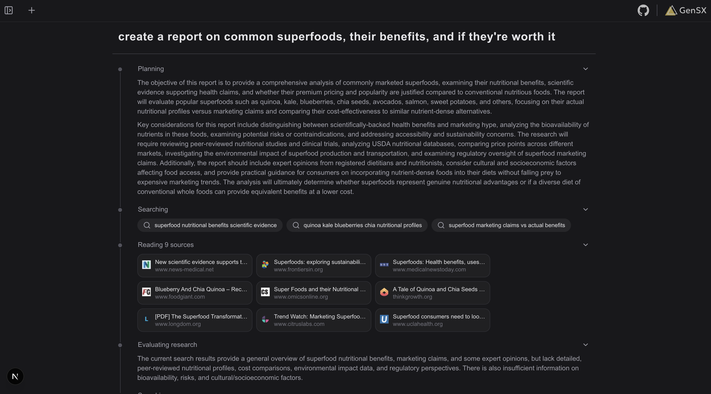

# GenSX Deep Research

This is a [Next.js](https://nextjs.org) deep research template for [GenSX](https://gensx.com) with a multi-step research workflow that iteratively searches the web, extracts key findings, and generates detailed reports.



## Getting started

To get started, first install the dependencies:

```bash
pnpm install
```

Then export the environment variables. For this template, you'll need both the [OpenAI API key](https://platform.openai.com), [Anthropic API key](https://www.anthropic.com/), and the [Tavily API key](https://www.tavily.com/):

```bash
export OPENAI_API_KEY=...
export ANTHROPIC_API_KEY=...
export TAVILY_API_KEY=...
```

```bash
pnpm run dev
```

This will start both the Next.js app as well as the local GenSX dev server. The app will be available at [http://localhost:3000](http://localhost:3000) and the GenSX dev server will be available at [http://localhost:1337](http://localhost:1337/swagger-ui).

## Deploying the app

### Deploying the GenSX workflows

To deploy the GenSX workflows, run:

```bash
pnpm run deploy
```

### Deploying the Next.js app

The easiest way to deploy your Next.js app is to use [Vercel](https://vercel.com/new?utm_medium=default-template&filter=next.js&utm_source=create-next-app&utm_campaign=create-next-app-readme).

Once you deploy, make sure to set the following environment variables so the app can access the GenSX workflows:

```bash
export GENSX_API_KEY=...
export GENSX_ORG=...
export GENSX_PROJECT=chat-tools
export GENSX_ENV=default
```
