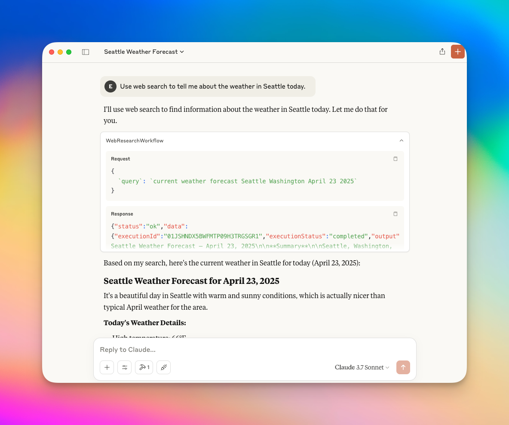

# @gensx/gensx-cloud-mcp

Model Context Protocol server for [GenSX Cloud](https://gensx.com/docs/cloud) workflows. Connect your GenSX Cloud workflows to MCP-compatible tools like Claude desktop, Cursor, and more.



## Usage

Once you have run [`gensx deploy`](https://www.gensx.com/docs/cli-reference/deploy) to deploy your project to the [GenSX Cloud serverless runtime](https://www.gensx.com/docs/cloud/serverless-deployments), you can consume those workflows via the `@gensx/gensx-cloud-mcp` server.

Update your MCP config file for your tool of choice to include the following:

```json
{
  "mcpServers": {
    "gensx": {
      "command": "npx",
      "args": [
        "@gensx/gensx-cloud-mcp",
        "you_org_name",
        "your_project_name",
        "your_environment_name"
      ]
    }
  }
}
```

By default, the server reads your API credentials from the config saved by running the `gensx login` command. Alternatively, you can specify your GenSX API key as an environment variable in your MCP config:

```json
{
  "mcpServers": {
    "gensx": {
      "command": "npx",
      "args": [
        "@gensx/gensx-cloud-mcp",
        "you_org_name",
        "your_project_name",
        "your_environment_name"
      ],
      "env": {
        "GENSX_API_KEY": "my_api_key"
      }
    }
  }
}
```

The GenSX build process automatically extracts input and output schemas from your typescript types, so no additional configuration or manual `zod` schema is required to consume your workflows from an MCP server.
