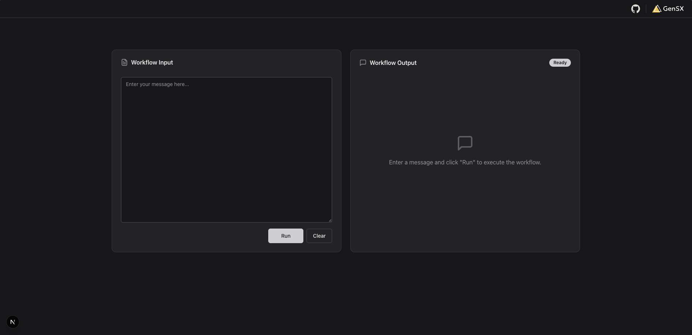

# GenSX Next.js Template

This is a [Next.js](https://nextjs.org) template for [GenSX](https://gensx.com) with streaming chat, thinking, and tools built in. It also includes chat history stored using `@gensx/storage`.



## Getting started

To get started, first install the dependencies:

```bash
npm install
```

Then export the environment variables. For this template, you'll need an [OpenAI API key](https://platform.openai.com):

```bash
export OPENAI_API_KEY=...
```

Finally, run the development server:

```bash
npm run dev
```

This will start both the Next.js app as well as the local GenSX dev server. The app will be available at [http://localhost:3000](http://localhost:3000) and the GenSX dev server will be available at [http://localhost:1337](http://localhost:1337/swagger-ui).

## Deploying the app

### Deploying the GenSX workflows

To deploy the GenSX workflows, run:

```bash
npm run deploy
```

### Deploying the Next.js app

The easiest way to deploy your Next.js app is to use [Vercel](https://vercel.com/new?utm_medium=default-template&filter=next.js&utm_source=create-next-app&utm_campaign=create-next-app-readme).

Once you deploy, make sure to set the following environment variables so the app can access the GenSX workflows:

```bash
export GENSX_API_KEY=...
export GENSX_ORG=...
export GENSX_PROJECT=...
export GENSX_ENV=default
```
